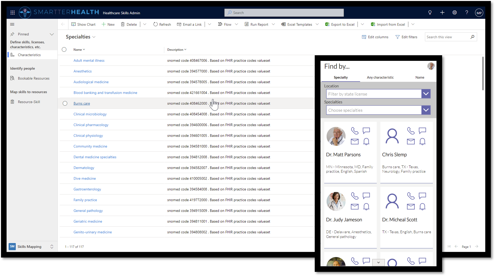

# Healthcare Characteristics

Extending Dataverse bookable resource characteristics table as a foundation for configuring common healthcare use cases with low-code.

## Features

- Use healthcare-specific criteria to route chats, calls, and records to the appropriate person, team, or queue.
- Search for available resources based on credentials and specialties.
- Supports additional resource categories
- Import your own skills list from .csv, Excel, or through secure integration with a practice management system

## Dependencies

- Dataverse with Bookable Resources (e.g. resources from Dynamics 365 Customer Service or Field Service)

## Deployment

1. Ensure that dependencies (above) are met and that you have an Environment Maker role (or equivalent) in the Environment
1. Deploy the current version of the managed solution to a Dataverse environment
    1. Publish the *Healthcare Skills Admin* Power App
1. Deploy sample data (or create your own)
1. Update Resources with their associated healthcare-related Characteristics via the **Healthcare Skills Admin app**

*The packaged solution .zip files included in this repository are intended for testing and educational purposes.*

## Major components

- Bookable resource characteristic type of State Licenses
- Bookable resource characteristic type of Specialties
- Table views configured for State Licenses and Specialties
- Application UI to manage these

## Design Decisions

- Configured **bookableresourcecharacteristictype** choice field to include *Specialty* and *State License* in the option set when adding Characteristics.
  - This introduces a dependency on the Rescource data model
  - This dependency mimimizes future configuration and potential duplication of data when setting up routing rules.

- Leveraging Dataverse tables for defining Resources and their associated characteristics.
  - Customers who are not already using Dataverse to represent relationships with these resources (e.g. Practitioners) will need to import/integrate provider information
  - This approach brings support for non-clinical and clinical characteristics to be searched in a unified manner.
  - There is an additoinal opportunity to expose a portal for practitioners and their staff to keep data up to date (e.g. preferred contact details, clinic associations, etc.)

- Note: Sample code for **bookableresourcecharacteristictype** global Choice field includes out of the box values as well, which will reset any environment-specific configurations. Alternatively, the choice field could be configured directly in the customer's own dev environment.

## Sample Data

This repository includes sample data that allows testing/modification without requiring a live FHIR integration.

1. Import the *csv* file found in the solutions folder of this repository
    1. Not sure how? Navigate to *Power Apps Maker Portal->Data->Patient Stays->Data* then use the **Import from CSV** action

file: characteristics-v2.0360.2.7.csv
source: https://www.hl7.org/fhir/v2/0360/2.7/index.html
Name: v2.0360.2.7
Title: v2 table 0360, Version 2.7
Definition: FHIR Value set/code system definition for HL7 v2 table 0360 ver 2.9 ( Degree/License/Certificate)

file: characteristics-specialties.csv
source: https://www.hl7.org/fhir/valueset-c80-practice-codes.html
Name: PracticeSettingCodeValueSet
Title: Practice Setting Code Value Set
Definition: This is the code representing the clinical specialty of the clinician or provider who interacted with, treated, or provided a service to/for the patient. The value set used for clinical specialty has been limited by HITSP to the value set reproduced from HITSP C80 Table 2-149 Clinical Specialty Value Set Definition.
Copyright: This resource includes content from SNOMED Clinical Terms® (SNOMED CT®) which is copyright of the International Health Terminology Standards Development Organisation (IHTSDO). Implementers of these specifications must have the appropriate SNOMED CT Affiliate license - for more information contact http://www.snomed.org/snomed-ct/get-snomed-ct or info@snomed.org

## Solution History

### Healthcare Skills 1.0.3

Initial release of the sample code, low-code app, and sample data. Source included in the /src folder and deployable solution files included in the /solutions folder.

## Contributing

This project welcomes contributions and suggestions.  Most contributions require you to agree to a
Contributor License Agreement (CLA) declaring that you have the right to, and actually do, grant us
the rights to use your contribution. For details, visit https://cla.opensource.microsoft.com.

When you submit a pull request, a CLA bot will automatically determine whether you need to provide
a CLA and decorate the PR appropriately (e.g., status check, comment). Simply follow the instructions
provided by the bot. You will only need to do this once across all repos using our CLA.

This project has adopted the [Microsoft Open Source Code of Conduct](https://opensource.microsoft.com/codeofconduct/).
For more information see the [Code of Conduct FAQ](https://opensource.microsoft.com/codeofconduct/faq/) or
contact [opencode@microsoft.com](mailto:opencode@microsoft.com) with any additional questions or comments.

## Trademarks

This project may contain trademarks or logos for projects, products, or services. Authorized use of Microsoft 
trademarks or logos is subject to and must follow 
[Microsoft's Trademark & Brand Guidelines](https://www.microsoft.com/en-us/legal/intellectualproperty/trademarks/usage/general).
Use of Microsoft trademarks or logos in modified versions of this project must not cause confusion or imply Microsoft sponsorship.
Any use of third-party trademarks or logos are subject to those third-party's policies.
